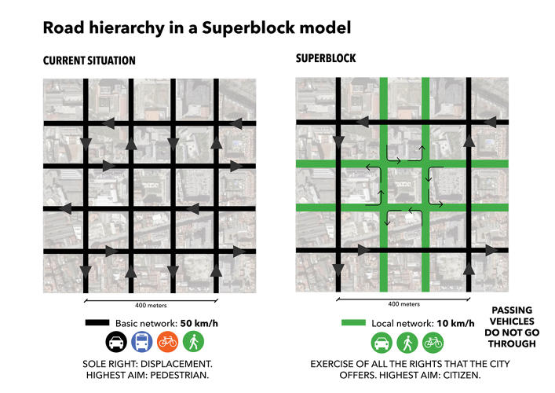
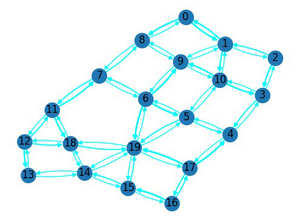
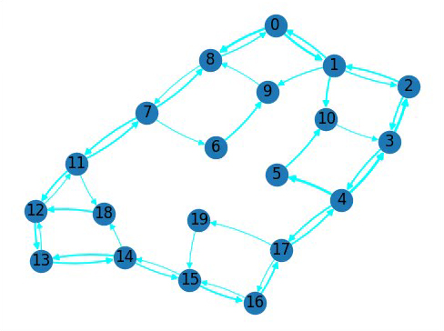
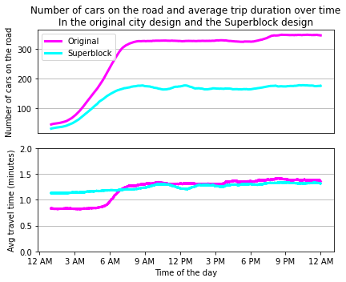

# Berlin Traffic Engineering Proposal: Superblocks

**Table of Contents**

- [Introduction](#introduction)
- [Methods](#methods)
	- [The Neighborhood](#the-neighborhood)
	- [Assumptions of the simulation](#assumptions-of-the-simulation)
- [Theoretical Expectations](#theoretical-expectations)
- [Results](#results)
- [Discussion](#discussion)
- [Conclusion](#conclusion)

## Introduction

Berlin has been falling behind other European cities in terms of city design, despite continuous (though [unsuccessful](https://www.theguardian.com/world/2020/aug/24/berlin-reports-rise-in-fatalities-as-new-bike-lanes-fail-to-keep-cyclists-safe)) efforts to improve.

One of the biggest issues Berlin faces is the the proliferation of cars on its roads, which are notorious for being the [worst mode of transportation](https://www.washingtonpost.com/news/in-theory/wp/2016/03/02/buses-and-trains-thats-what-will-solve-congestion/) in cities because of their size, pollution, and noise. Previously, Berlin city government tried to address one of these by introducing a [Low Emission Zone](https://www.berlin.de/sen/uvk/en/environment/air/low-emission-zone/) in central Berlin where only low-emission vehicles are allowed, which did reduce pollution, but was still focusing on treating one of the symptom instead of addressing the core problem: incentive for residents to drive.

Other cities in Europe have been experimenting with car-free designs, notably, Barcelona's project of Superblocks helped [free up to 92% of public space](https://energy-cities.eu/best-practice/superblocks-free-up-to-92-of-public-space-in-barcelona/) by limiting where cars are allowed to drive thereby encouraging people to walk and bike. 

*Figure 1*. A Superblock is a bounded collection of nearby city blocks where drive-through traffic has been replaced by one-way roads with a very low speed limit for cars. No new construction required, which is why such a design is very easy to implement in any city.

So in this report, we will simulate what will happen to car traffic if we try establishing a Superblock inside of Berlin. 

## Methods 

### The Neighborhood

The neighborhood selected to be included in the Superblock were the streets enclosed by Köpenicker Straße, Heinrich-Heine-Straße, Adalbertstraße, and Oranienstraße (where the Minerva res hall is). 

The most handy way to represent a neighborhood for our purpose is through a graph where nodes are the intersections and edges are the streets connecting those intersections. The graph would be directed to allow for one-way streets, and weighted to account for different lengths of the streets.

*Figure 2*. The neighborhood in question with node numbers used in the simulation. 

*Figure 3*. Graph of car traffic in the representation of the original neighborhood. The speed limit is 50 kn/h on peripheral roads and 30 km/h on the internal roads.

*Figure 4*. Graph of car traffic in the Superblock representation of the neighborhood. The speed limit is 50 kn/h on peripheral roads and 10 km/h on the internal roads. 

In the Superblock design of the neighborhood, all  internal roads have been turned into one-way streets for car trafic, with one of the two (3-meter) car lanes having been turned into two (1.5-meter) bike lanes. Some car lanes have been removed completely like those between 5, 6, 18, and 19, but they are still available for bikes and pedestrians in both directions.

### Assumptions of the simulation

The simulation consists of two main components, (1) the map - a graph of streets and intersections as edges and nodes - and (2) the travelers, traversing the graph by car/bike/walk depending on whichever mode of transport gets them faster to their destination, considering traffic. This simplified model of the neighborhood should be enough to represent the real world because it does contain the important relationship between the ease to travel somewhere by car and people's choice to do (or not to do) so. 

Each street has 7 properties:
1. The node it starts from
2. The node it goes into
3. The length of the street (in meters)
4. The speed limit on the streets (for cars)
5. The number of car lanes in that direction
6. The number of bike lanes in that direction
7. The width of sidewalk in meters for walking in that direction

A traveler is generated at a random intersection with a randomly chosen destination. Then the traveler chooses which mode of transport they would get to the destination with: a car, a bike, or by foot, based on which one takes them faster to their destination. When choosing, the traveler (presumably using Google Maps) is aware of how congested the streets are and takes that into account when deciding on the fastest route for each mode of transportation. 

After the traveler decided on the path and the mode of transportation, they follow this path even if the road conditions change and cannot change the mode of transportation in the middle of the journey. 

Congestion is determined by road occupancy for each type of transport using different formulas. Occupancy is calculated using the formula: , i.e., the number of vehicles on the road multiplied by the average length of a vehicle (in meters) to get the total area occupied by vehicles, divided by length of the street in meters multiplied by the number of lanes for those vehicles giving the total area of the street. Then, occupancy is converted to a speed multiplier (a measure of congestion) using a linear formula set up for each mode of transport. For cars, based on [empirical data](https://course-resources.minerva.kgi.edu/uploaded_files/mke/YpqvNV/nagel-schreckenberg.pdf), the speed multiplier is 1 for until 20% occupancy, and then it linearly decreases from 1 to 0 as occupancy goes from 10% to 100%. For bicycles, the speed multiplier is 1 until 50% (because of lower speed of bicycles), and then it decreases to 0.16 (slow walking) as occupancy rises. For walking, occupancy up to 50% is 1, and then decreases up to 0.36 (very slow walking). If there is no bike lane, the speed multiplier by bicycle is calculated using the car speed multiplier and the existing car occupancy, and if there are no car lanes, using the pedestrian multiplier and occupancy.

Cars are assumed to always go with the maximum possible speed (i.e., the speed limit minus road occupancy), bikes are assumed to go on average 22 km/h and pedestrians are assumed to walk on average 5 km/h.

For each of the 20 nodes, the arrival rate per minute to each node is , where  is time in hours of the day, i.e., 1 car per minute at 1 am and 7 cars per minute at 11 am (based on empirical observations).

Since the simulation is not very chaotic and is fairly homogeneous across time, running it for a prolonged period of time would be equivalent to running it multiple times. So running the simulation for 24 hours in 10-second increments (in larger increments, the cars might move too fast) for each of the designs should provide enough data to arrive to definitive conclusions.

## Theoretical Expectations

To estimate theoretically how many cars will be taken off the road by the Superblock design, we can start by taking a look at the formula for travel speed by car:

,
where  is the speed limit on the given street and  is the speed multiplier (depends on occupancy). 

Then, we can use the formula for :

where  is the occupancy of the road by cars,

And the formula for :

where  is the number of cars on the street,  is the average length of a car (plus extra space required to move),  is the number of car lanes in a given direction, and  is the length of the street. 

This will give us the complete formula for car speed. 

Since we're estimating the macro-state of the simulation, we can use the average values for street length, car lanes, etc, for both the original and the Superblock designs, which will give us:

If we wanted to estimate the actual maximum number of cars on the streets for each of the city designs, we could've solved for  given the speed  is equal to 22 (the bike speed) because after this critical point it becomes faster to travel by bike for every additional traveler, and we would've seen that in Superblock design this threshold is reached with far fewer cars than in the original design. However, since we're more interested in the relative impact of the Superblock design rather then the absolute car numbers which are likely to be inaccurate anyways, we can simply divide the slope of the original model by the slope of the Superblock model which will give us the value of how much fewer cars in the Superblock design would constitute the same speed as the original design, which would also be proportional to the ratio of number of cars on the road between the two models. In this case, this value is: , i.e., the Superblock design would be expected to nearly halve the number of cars on the road compared to the original road design.

## Results

*Figure 5*. Results of the simulation showing the advantages of the superblock design in two metrics: nearly half as many cars and slightly faster average travel time.

As we can see, the Superblock design not only cut the number of cars on the streets almost in half (which matches the theoretical expectations), but it also preserved the same average travel time and even increased it by a bit on average (-2 sec, p<0.001). In fact, the only time when the original design offered faster travel time was in the beginning of the simulation when the streets have not been populated yet, which does not happen very often in real life. 

## Discussion

There are several reasons why Superblock design would decrease the number of cars on the streets. One reason is that it simply reduces the number of roads for cars, i.e., the fewer car lanes there are the easier the remaining one congest, and the sooner it becomes faster for each individual person to travel via empty bike lanes than via the congested roads, so after some critical threshold of road congestion is reached, every additional person would opt to travel by bike simply because it's faster, which leads to the proliferation of bikes and plateauing of the number of cars at a lower number than before.

Increased road congestion forcing people to use bikes is not the only mechanism by which the Superblock design achieves its goal. The second reason for its success is likely the way the remaining roads are arranged, i.e., the one-way-street structure of the internal roads makes car routes much longer because of inability to go through the Superblock, e.g., if one needs to travel from intersection 4 to intersection 7, a route by car would have to go: 4 -> 3 -> 2 -> 1 -> 0 -> 8 -> 7, while a route by bike (for which the streets are not one-way), it is simply 4 -> 5 -> 6 -> 7, which neglects the differences in speed and encourages people to bike.

However, both reasons of the above focus on making traveling by car take more time, which should suggest that we should also notice an increase in average travel time in the Superblock model. The reason why it didn't happen was likely because the Superblock design also made traveling by bike easier by converting some of the car lanes into bike lanes so that when roads do get congested, bikes lanes remain available, compared to the original design where car congestion on a street with no bike lanes made bikes suffer from the congestion as well, thus slowing down their speed. 

## Conclusion

So, the Superblock design has been shown in the simulation to dramatically decrease the number of cars on the streets by encouraging people to bike without a significant decrease in their travel time (and even a slight increase). Besides that, it also offers other benefits that were not reflected in the simulation like the reduced noise and air pollution resulting from lower number of cars, increased attractiveness of the neighborhood to potential future residents, or the cultural impact on the German people who can now realize that life without cars is highly possible and maybe also quite enjoyable.

